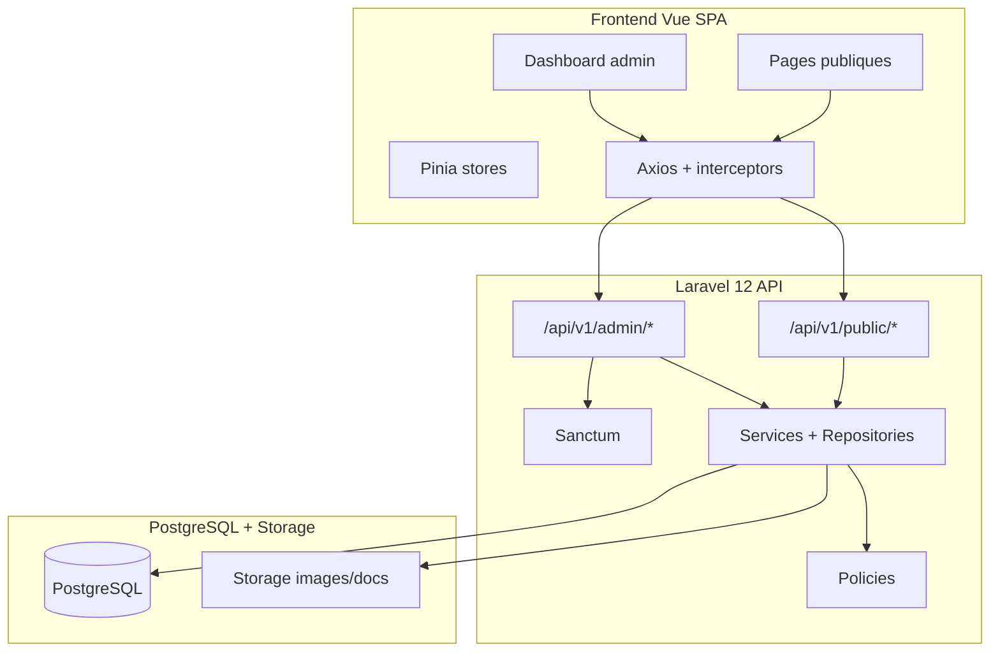

# La nouvelle institution — Architecture

Site web scolaire premium (FR) — monorepo API REST + SPA Vue.

## Décisions figées

| Choix | Valeur |
|-------|--------|
| Structure | Monorepo : `api/` (Laravel 12) + `frontend/` (Vue 3) |
| Admissions | Informatives + formulaire de demande (pas de dossier complet en ligne) |
| Langue | Français (UI, contenu, admin) |
| Auth | Laravel Sanctum — admin uniquement |
| Base de données | PostgreSQL |
| Rôles | spatie/laravel-permission |

## Schéma global

## Principes

- API-first sous `/api/v1`
- Controllers fins → Form Requests → Services → Eloquent
- Repositories uniquement pour requêtes complexes/réutilisées (galerie, activités)
- API Resources pour toutes les réponses JSON
- Policies sur les ressources admin
- Endpoints publics en lecture seule, sauf contact / demande d’admission
- Frontend : modules par feature, design system partagé, composables GSAP

## Stack

**Backend :** Laravel 12, PHP 8.3+, PostgreSQL, Sanctum, spatie/laravel-permission  
**Frontend :** Vue 3 Composition API, Vue Router, Pinia, Axios, Tailwind CSS, GSAP, Vite  
**Qualité :** SOLID, Form Requests, Policies, Resources, Services
