# Modèle de données (PostgreSQL)

## Diagramme ER

```mermaid
erDiagram
  users ||--o{ model_has_roles : has
  roles ||--o{ model_has_roles : assigned
  roles ||--o{ role_has_permissions : grants
  permissions ||--o{ role_has_permissions : included

  activity_categories ||--o{ activities : categorizes
  activities ||--o{ activity_images : has
  gallery_categories ||--o{ gallery_images : categorizes
  programs ||--o{ program_features : has

  users {
    bigint id PK
    string name
    string email UK
    string password
    boolean is_active
    timestamp email_verified_at
    timestamps timestamps
    softDeletes deleted_at
  }

  teachers {
    bigint id PK
    string full_name
    string title
    string subject
    text bio
    string photo_path
    int sort_order
    boolean is_published
    softDeletes deleted_at
  }

  programs {
    bigint id PK
    string slug UK
    string title
    text summary
    text description
    string icon
    string image_path
    int sort_order
    boolean is_published
    softDeletes deleted_at
  }

  program_features {
    bigint id PK
    bigint program_id FK
    string label
    int sort_order
  }

  activity_categories {
    bigint id PK
    string slug UK
    string name
    int sort_order
  }

  activities {
    bigint id PK
    bigint category_id FK
    string slug UK
    string title
    text excerpt
    text body
    string cover_path
    date event_date
    boolean is_featured
    boolean is_published
    softDeletes deleted_at
  }

  activity_images {
    bigint id PK
    bigint activity_id FK
    string image_path
    string alt_text
    int sort_order
  }

  gallery_categories {
    bigint id PK
    string slug UK
    string name
    int sort_order
  }

  gallery_images {
    bigint id PK
    bigint category_id FK
    string title
    string image_path
    string alt_text
    int sort_order
    boolean is_published
    softDeletes deleted_at
  }

  testimonials {
    bigint id PK
    string author_name
    string author_role
    text content
    string photo_path
    int rating
    int sort_order
    boolean is_published
  }

  documents {
    bigint id PK
    string title
    string file_path
    string category
    int sort_order
    boolean is_published
    softDeletes deleted_at
  }

  contact_messages {
    bigint id PK
    string name
    string email
    string phone
    string subject
    text message
    string source
    string status
    string desired_level
    timestamps timestamps
  }

  homepage_sections {
    bigint id PK
    string key UK
    jsonb content
    boolean is_enabled
  }

  site_settings {
    bigint id PK
    string group_name
    string key UK
    text value
  }

  statistics {
    bigint id PK
    string key UK
    string label
    int value
    string icon
    int sort_order
  }

  timeline_events {
    bigint id PK
    string year_label
    string title
    text description
    string icon
    int sort_order
  }
```

## Tables et responsabilités

| Table | Rôle |
|-------|------|
| `users` | Comptes admin |
| `roles` / `permissions` + pivots | Gestion des rôles (Spatie) |
| `teachers` | Équipe pédagogique |
| `programs` + `program_features` | Programmes académiques |
| `activity_categories` + `activities` + `activity_images` | Activités / actualités |
| `gallery_categories` + `gallery_images` | Galerie |
| `testimonials` | Témoignages (parents, élèves, anciens) |
| `documents` | PDF admissions / téléchargements |
| `contact_messages` | Contact + demandes admission (`source`: `contact` \| `admission`) |
| `homepage_sections` | Blocs CMS accueil (JSON) |
| `site_settings` | Téléphone, email, adresse, Facebook, maps |
| `statistics` | Compteurs animés |
| `timeline_events` | Chronologie À propos |

## Rôles seed

| Rôle | Accès |
|------|--------|
| `super_admin` | Tout |
| `admin` | Contenu + utilisateurs (pas édition des rôles) |
| `editor` | Enseignants, galerie, activités, accueil, documents |
| `viewer` | Lecture seule dashboard |

## Contraintes

- Uniques : `email`, slugs, `site_settings.key`, `homepage_sections.key`, `statistics.key`
- Soft deletes : `users`, `teachers`, `programs`, `activities`, `gallery_images`, `documents`
- FK : catégories → activités / images (restrict ou nullify)
- `contact_messages.status` : `new` \| `read` \| `archived`
- `contact_messages.source` : `contact` \| `admission`
- `documents.category` : ex. `admission`, `reglement`, `autre`

## Contenu seed contact (réel)

- Téléphone : `05228-75634`
- Email : `gsni2527@gmail.com`
- Adresse : `25 Rue Adawha El Fath 3, Casablanca, Morocco`
- Facebook : `https://web.facebook.com/profile.php?id=100056328531139&sk=photos`
- École : La nouvelle institution — Depuis 1997
